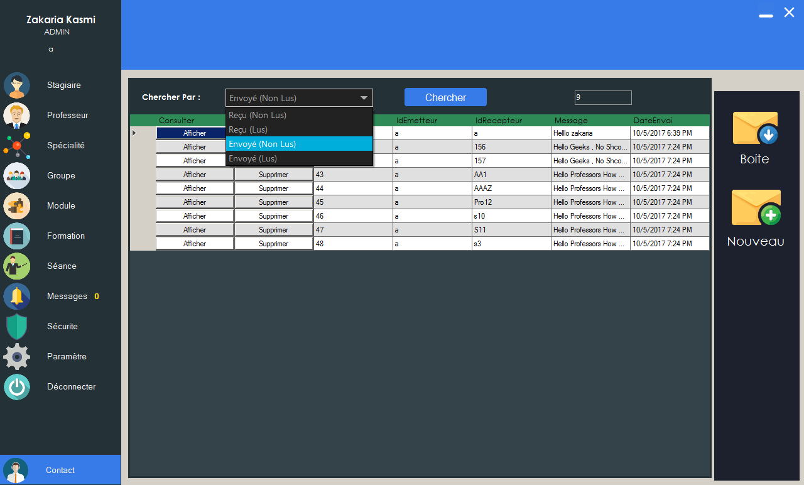
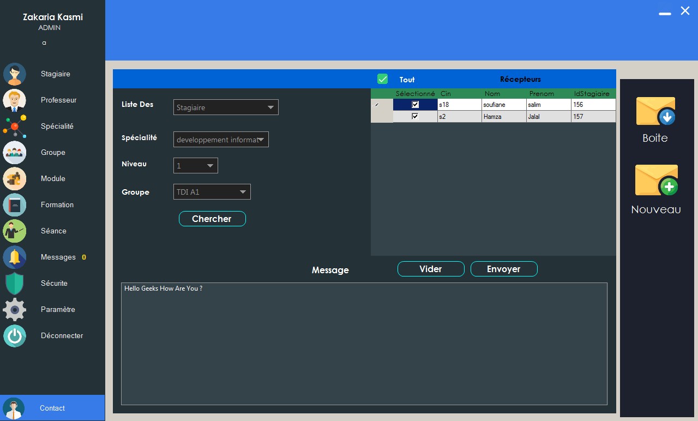
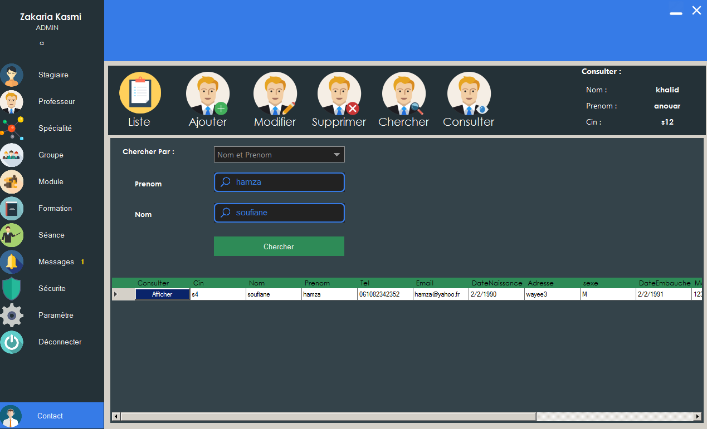

# School-Management-Software
developed by Zakaria Kasmi 

School Management App is one of my best projects so far .
Features . 
- Students Management , you can add delete edit students 
- search for students by Id , Name ..

- Professors Management , you can add delete edit Professors ,
  -search for Professors by Id , Name ..

- Groups Management , Add Edit Delete Groups .
- Courses Management Add Edit Delete Courses .
- Class Management Add Edit Delete Classes

- TimeTable System To Assign Courses To Groups , Add Delete Edit TimeTable for Each Group
  - each Course has a professor 
  
- Chat System Between Professors , Students , Admins ,
  - you can send a Message To all Students of A Group 
  - Send Messages To all professors 
  - Send Message to a specific Person 
  - You can know if the message is seen or not (like Whatsapp)
- Login Form 
- Notification Area
- Archive System That Stores All Users (even if you delete it from database)

(the app contains more Feature ,please  Feel Free To Download The app and Explore it )
Copyright Zakaria kasmi 

